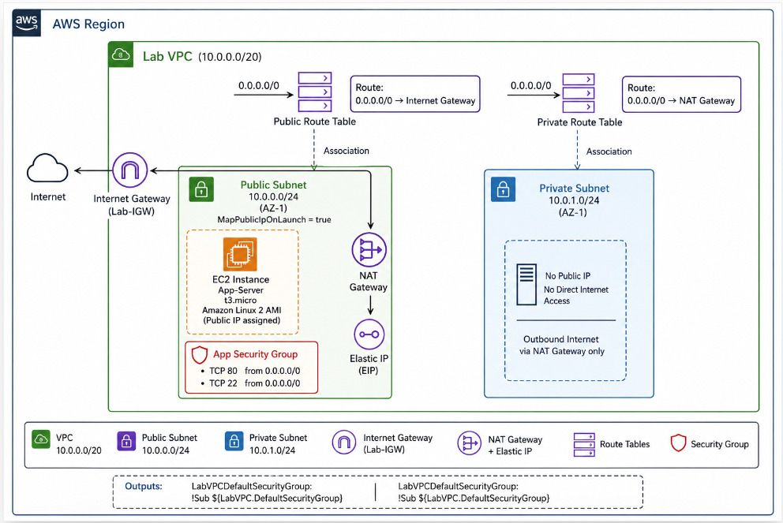
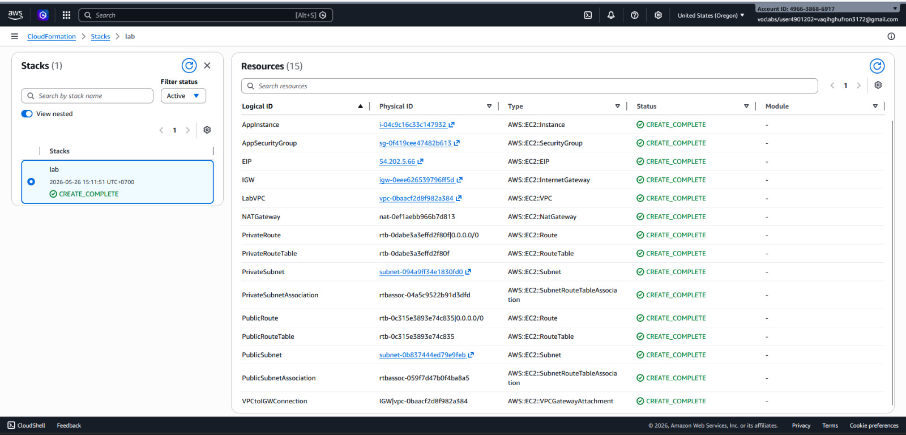

# AWS VPC with Public & Private Subnets

This project demonstrates the deployment of a secure AWS networking environment using AWS CloudFormation. The infrastructure includes a custom VPC, public and private subnets, routing components, security controls, and an EC2 instance provisioned through Infrastructure as Code (IaC).

---

## Architecture



---

## Overview

This CloudFormation template provisions an isolated AWS environment consisting of:

* Amazon VPC
* Public Subnet
* Private Subnet
* Internet Gateway
* NAT Gateway
* Elastic IP
* Route Tables
* Security Group
* Amazon EC2 Instance

The architecture follows common AWS networking best practices by separating internet-facing resources from internal resources.

---

## Network Topology

```text
Internet
    │
    ▼
Internet Gateway
    │
    ▼
Public Route Table
    │
    ▼
Public Subnet (10.0.0.0/24)
    │
 ┌──┴─────────────┐
 │                │
 ▼                ▼
EC2 Instance   NAT Gateway
                    │
                    ▼
Private Route Table
                    │
                    ▼
Private Subnet (10.0.1.0/24)
```

---

## Deployment Result

The CloudFormation stack was successfully deployed and all resources reached the `CREATE_COMPLETE` state.

### AWS CloudFormation Deployment



### Provisioned Resources

* Amazon VPC
* Public Subnet
* Private Subnet
* Internet Gateway
* NAT Gateway
* Elastic IP
* Route Tables
* Security Group
* EC2 Instance

---

## Resources Created

### Amazon VPC

* CIDR Block: `10.0.0.0/20`
* DNS Support Enabled
* DNS Hostnames Enabled

### Public Subnet

* CIDR Block: `10.0.0.0/24`
* Auto-assign Public IP Enabled

### Private Subnet

* CIDR Block: `10.0.1.0/24`
* No Direct Internet Access

### Internet Gateway

* Enables internet connectivity for public resources

### NAT Gateway

* Provides outbound internet access for private resources

### Route Tables

**Public Route Table**

```text
0.0.0.0/0 → Internet Gateway
```

**Private Route Table**

```text
0.0.0.0/0 → NAT Gateway
```

### Security Group

Allowed inbound traffic:

| Port | Protocol | Purpose |
| ---- | -------- | ------- |
| 80   | TCP      | HTTP    |
| 22   | TCP      | SSH     |

### EC2 Instance

* Instance Type: `t3.micro`
* Operating System: Amazon Linux 2
* Deployed in Public Subnet

---

## Documentation

Detailed documentation is available in the `docs` directory:

* 01-vpc.md
* 02-subnet.md
* 03-internet-gateway.md
* 04-nat-gateway.md
* 05-route-table.md
* 06-security-group.md
* 07-ec2.md

---

## Skills Demonstrated

* AWS CloudFormation
* Infrastructure as Code (IaC)
* Amazon VPC
* Public & Private Subnets
* Internet Gateway
* NAT Gateway
* Route Tables
* Security Groups
* Amazon EC2
* AWS Networking Fundamentals
* Cloud Infrastructure Design

---

## How to Deploy

Ensure AWS CLI is installed and configured with valid credentials.

```bash
aws cloudformation create-stack \
  --stack-name MyLabStack \
  --template-body file://cloudformation/vpc-template.yaml \
  --capabilities CAPABILITY_IAM
```

Monitor deployment progress through:

```text
AWS Console
→ CloudFormation
→ Stacks
```

---

## Project Structure

```text
aws-foundations-project
├── README.md
├── cloudformation
│   └── vpc-template.yaml
├── diagrams
│   └── diagrams.jpeg
├── docs
│   ├── 01-vpc.md
│   ├── 02-subnet.md
│   ├── 03-internet-gateway.md
│   ├── 04-nat-gateway.md
│   ├── 05-route-table.md
│   ├── 06-security-group.md
│   └── 07-ec2.md
└── screenshots
```
